# Coding profile

_Regenerated on every sync — last run 2026-09-01._

## This week

## At a glance

| | |
| --- | --- |
| Problems solved | 57 |
| Due for revision today | 56 |
| Revisions completed | 4 |
| Current streak | 6 days |
| Submissions recorded | 61 (10 rejected) |
| Runs recorded | 37 |
| Median time to solve | 1 min |

## Needs work

| Topic | Solved | Lapses | Mastery |
| --- | --- | --- | --- |
| number theory | 5 | 1 | 0/100 |
| enumeration | 3 | 1 | 0/100 |
| dp | 2 | 1 | 0/100 |
| math | 20 | 1 | 22/100 |
| brute force | 3 | 0 | 42/100 |

## Solid

| Topic | Solved | Mastery |
| --- | --- | --- |
| prefix sum | 2 | 45/100 |
| sorting | 2 | 45/100 |
| binary search | 2 | 45/100 |
| strings | 2 | 45/100 |
| sliding window | 3 | 45/100 |

## Fought hardest for these

Scored from the attempts it actually took — failed submits, runs, wrong answers and time spent.

| Problem | Submits | Runs | Time | Cost |
| --- | --- | --- | --- | --- |
| [Carrot Chopdown (Hard Version)](https://codeforces.com/contest/2258/problem/B2) | 5 | 0 | — | 47/100 |
| [Peaks in Array II](https://leetcode.com/problems/peaks-in-array-ii/) | 1 | 7 | — | 33/100 |
| [Odd Eraser](https://codeforces.com/contest/2258/problem/A) | 3 | 0 | — | 30/100 |
| [Weighted Sum of a Tree](https://leetcode.com/problems/weighted-sum-of-a-tree/) | 1 | 4 | — | 25/100 |
| [Another Popcount Problem](https://codeforces.com/contest/2240/problem/A) | 1 | 0 | 2h 42m | 20/100 |
| [Removing Minimum and Maximum From Array](https://leetcode.com/problems/removing-minimum-and-maximum-from-array/) | 2 | 0 | 1 min | 17/100 |
| [Maximum Valid Split Positions I](https://leetcode.com/problems/maximum-valid-split-positions-i/) | 1 | 3 | — | 16/100 |
| [Count Integers Appearing in a Single Block](https://leetcode.com/problems/count-integers-appearing-in-a-single-block/) | 1 | 4 | 8 min | 14/100 |
| [Carrot Chopdown (Easy Version)](https://codeforces.com/contest/2258/problem/B1) | 1 | 0 | — | 10/100 |
| [Minimum Operations to Form Subset Sum I](https://leetcode.com/problems/minimum-operations-to-form-subset-sum-i/) | 1 | 3 | — | 9/100 |

## Revision queue

| Problem | Stage | Reviews | Due |
| --- | --- | --- | --- |
| [Smallest Divisible Digit Product II](https://leetcode.com/problems/smallest-divisible-digit-product-ii/) | 1 | 0/6 | 2026-08-08 |
| [Find the Lexicographically Smallest Valid Sequence](https://leetcode.com/problems/find-the-lexicographically-smallest-valid-sequence/) | 1 | 0/6 | 2026-08-09 |
| [Minimum Total Price After Applying Discounts](https://leetcode.com/problems/minimum-total-price-after-applying-discounts/) | 1 | 0/6 | 2026-08-10 |
| [Weighted Sum of a Tree](https://leetcode.com/problems/weighted-sum-of-a-tree/) | 1 | 0/7 | 2026-08-10 |
| [Maximum Area of Two Non-Overlapping Square Submatrices](https://leetcode.com/problems/maximum-area-of-two-non-overlapping-square-submatrices/) | 1 | 0/6 | 2026-08-10 |
| [Peaks in Array II](https://leetcode.com/problems/peaks-in-array-ii/) | 1 | 0/7 | 2026-08-10 |
| [Stone Game II](https://leetcode.com/problems/stone-game-ii/) | 1 | 0/6 | 2026-08-10 |
| [Divide and Conquer](https://codeforces.com/contest/2241/problem/A) | 1 | 0/6 | 2026-08-10 |
| [Stone Game IV](https://leetcode.com/problems/stone-game-iv/) | 1 | 0/6 | 2026-08-11 |
| [Smallest Missing Integer Greater Than Sequential Prefix Sum](https://leetcode.com/problems/smallest-missing-integer-greater-than-sequential-prefix-sum/) | 1 | 0/6 | 2026-08-12 |

---

Practise these on [Parikshaa](https://parikshaa.org) — curated DSA sheets, roadmaps and
company-wise problem sets, with your solves ticked off automatically.

Generated by [Redo](https://github.com/deepakvish001/New-Repo) — spaced-repetition revision for DSA, synced with [Parikshaa](https://parikshaa.org).
